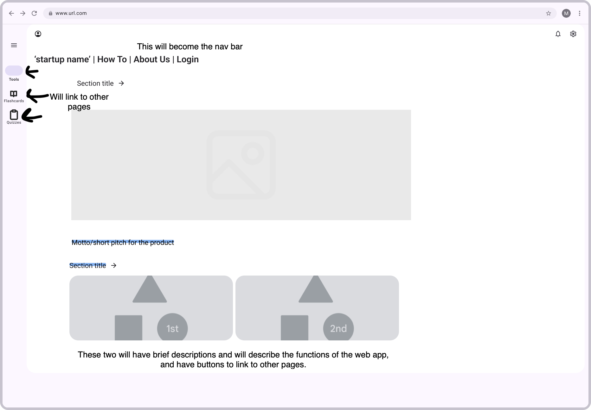

# startup

---

## Specifications

Here are the specifications for my startup web application, which will be a quiz design and studying application. These specs include a short pitch, overview of features, and a description of how certain technologies will be used.

### Elevator Pitch

My application will help you study in a way that emphasizes semantic encoding, allowing you to really remember not just pieces of information, but why that information is important. It will also provide methods for collaborative study. This application will also provide tools for instructors to design smarter methods of studying for their students.

### Features

- The application will emphasize semantic encoding, which is the process of encoding information in a way that emphasizes the meaning of the information, rather than just the information itself. This will be done by requiring users to enter not simply correct answers, but also the method through which they remembered the information, and what meaning the information holds.
- The application will support multiple-choice and short answer quizzes, as well as flashcards.
- The application will support collaborative study, allowing users to share quizzes and flashcards with each other, and to view quiz scores.
- Open-source APIs will be used to provide information for various quizzes and flashcards, expanding the application's funcitonality.

### Technologies

- HTML: This will be used to structure the different pages of the application, such as the flashcards, the quizzes, and the profile and home pages. HTML `input` elements will be used to receive andswers and for quiz design.
- CSS: This will be used to style the pages, creating a consistent theme, and it will also be used for animations and transitions. CSS will also be used to create responsiveness for mobile devices and various monitor sizes.
- JavaScript: This will handle the input from the HTML `input` elements, evalutate quiz logic and assign scores, and handle the sharing of quizzes and flashcards.
- React: This will be used to create reusable components, such as flashcards, quiz questions, and others. React will also be used to manage the state of the application, such as the user's score, the user's profile information, and the user's quizzes and flashcards.
- Web service APIs: As stated before, various available APIs will be used to provide added functionality to the application, such as quiz questions or flashcards on certain topics, and other functions
- Authentication: This will be used to secure data and user information, and to allow users to log in and out of the application and have distinct profiles.
- Database usage: This will be used to store created quizzes and flashcards, as well as prior quiz scores and user information.
- WebSocket data: This will be used for the collaborative study feature, allowing users to share quizzes and flashcards with each other in real time, and view quiz scores and status (online, in quiz, offline, etc.) of other users.

### Outline Sketch

## HTML Deliverable

Overviews of the HTML pages needed:

- index.html: home page
- account.html: user profile page
- study.html: page for selecting and quizzes and flashcards
- quizTemplate.html: template page for taking specific quizzes
- quizEdit.html: page for editing quizzes
- flashcardTemplate.html: template page for viewing a certain flashcard deck
- flashcardsEdit.html: page for editing flashcards
- about.html: about page

Here, I will describe how this delivarable helps achieve the specifications outlined above.

### Features: HTML

- The quiz Template and Edit pages, and flashcard Template and Edit pages will provide a space for users to create quizzes and flashcards and including their semantic encoding methods. These were implemented using `input` elements that had their `required` attribute set to true.
- The quizEdit.html page is where the support for multiple choice and short answer is found. This was implemented using `input` elements with `type="radio"` and `type="text"` for multiple choice and short answer, respectively.
- Sharing quizzes and flashcards is done through the flashcardTemplate.html and quizTemplate.html pages, where a `button` element is placeholding for when that functionality is fully implemented. For viewing quiz scores and other people's study stats using WebSocket data, that will be displayed on the study.html page.
- Open-source APIs are given placeholder locations in quizEdit.html and flashcardsEdit.html, where a button is placed that will eventually call an API to give users ideas for quiz questions and flashcard terms.

### Technologies: HTML

- HTML was used to create the full structure of the page. It will however, be open to adjustments as implementation continues and understanding of the avaliable technologies grows.
- CSS was not yet implemented.
- JavaScript was not yet implemented.
- React was not yet implemented.
- Web service APIs were not yet implemented, but given placeholder buttons on the quizEdit.html and flashcardsEdit.html pages.
- Authentication was not yet implemented, but was given placeholder Login and Logout buttons in the `header` element of each page.
- Database usage was not yet implemented, but was given a placeholder div element in the account.html page.
- WebSocket data was not yet implemented, but was given placeholder div element in the study.html page.

## CSS Deliverable

Overview of CSS implementation:

CSS Styling was added to this application primarily using the Bootstrap 5 external framework. A custom CSS file was also used for some more specific styling to suit the needs of the application. The [Bootstrap Docs](https://getbootstrap.com/docs/5.2/getting-started/introduction/) and [W3Schools](https://www.w3schools.com/bootstrap5/index.php) docs were referenced extenstively, so I have linked to them here.

Due to the current time restraints of this project, styling was not taken to an extreme or fully drawn out level, but enough to give an appealing and professional look. I will now elaborate on how the CSS implementation helps achieve the features and technology usages outlined above.

### Features: CSS

- The fields for Semantic encoding on quiz answers and on editing fields were given `defaultValue` attributes of "Semantic Device" to indicate to the user the need for that information. CSS transitions were also used to flip flashcards, and make the backside "hidden". This functionality is not fully complete for interaction, but that will be handled when JavaScript is introduced to the application. Perplexity AI was consulted in the creation of the flip animation, and [here](https://www.perplexity.ai/search/what-would-be-the-most-practic-.PPFSQXRS_C3lgHIok9khw) is a link to the prompt used and information given.
- Quizzes were styled for both multiple choice and short answer, without proper behavior and exclusivity of one question type or the other.
- Sharing buttons were styled, and the areas where WebSocket live data and other user's study stats will be displayed were styled as well, with placeholder values inside them.
- Buttons that will interact with the open-source APIs were styled tas desired.

### Technologies: CSS

- HTML previously  used to create the full structure of the page. Some minor adjustments were made, such as wrapping some `button` elements in `form` elements, or wrapping elements in `div` elements to make them easier to style.
- CSS was fully implemented according to assignment specifications, subject to minor changes as the application develops.
- JavaScript was not yet implemented.
- React was not yet implemented.
- Web service APIs were not yet implemented, but placeholders were styled..
- Authentication was not yet implemented, but placeholer login and logout buttons were styled.
- Database usage was not yet implemented, but a placeholder `table` element was styled.
- WebSocket data was not yet implemented, but the placeholder `table` created was styled.

## React Deliverable

Overview of React implementation:

React was implemented by porting the entire application to a React app, which is bundled, built, and deployed using Vite. Separate view components were made for each of the "Home", "Study", "Account", and "About" tabs. Within the "Study" tab is where most of the additional files are, since that is where the majority of the behavior is. This included a component created for the Flashcard items, and for editing the Flashcards. The Quiz components still need to be implemented, as well as the components for updating account information. The react hook `useState` is used in the flashcard components to track which deck of flashcards is being studied or edited, and is updated when that is changed. A React router is used in the App component to route between different components.

To be frank, this deliverable is not implemented according to the feature specifications outlined above. The time restrains of this assignment along with personal shortcoming contributed to this, so a significant portion of the features remain unimplemented. I am committed to spending time on this project after this course however, to fully implement the features and technologies outlined above. In the mean time, I will outline how what is currently presented does meet the specifications.

### Features: React

- The ability to study using flashcards was fully implemented with this deliverable. Flashcard decks can be created, with any number of flashcards, and existing decks can be edited. The semantic encoding fields are present and functional, the card is able to flip upon clicking a button, whereas before the card flipped on mouse hover, making actually entering text in the front-side fields impossible. Edits will properly appear on a saved flashcard, and cards can be added to a deck without problem. Logic is present to allow the program to work regardless of the number of flashcards in a deck, the number of decks in local storage, and other cases.

### Technologies: React

- HTML previously was used to create the full structure of the page. The HTML files were deleted, and the rendered HTML was moved to be included in the return statements of the corresponding React components. Some adjustments were made, such as additional buttons, as development needs arose.
- CSS was fully implemented according to assignment specifications, adjusted slightly to work with React components. Stylesheets for indiviual components were created as necessary
- JavaScript was implmented via React.
- React was about 50% implemented, with full functionality for flashcards, with quizzes and account editing to be implemented soon.
- Web service APIs were not yet implemented, but placeholders were styled.
- Authentication was not yet implemented, but placeholer login and logout buttons were styled.
- Database usage was not yet implemented, but a placeholder `table` element was styled.
- WebSocket data was not yet implemented, but the placeholder `table` created was styled.

## Web Service Deliverable

Overview of Web Service implementation:

Web services were implemented by adding Express.js to the backend. The index.js file running Node.js was edited to include express and other needed libraries. A combination of personally designed endpoints and 3rd party ones were used to provide the services needed. One was designed for user creation, one for logging in an existing user, and one for logging a user out. An object to store all of the user data was created, with the key being the username of each user. The logout endpoint middleware would update the value of that user with any Flashcard deck changes that were made. The service is being run by a PM2 daemon on the backend, so that the data won't be lost, until a database is implemented.

For 3rd party API calls, the Datamuse API was used (see link [here](https://www.datamuse.com/api/)). The specific endpoint used was the `/words?ml=${searchTerm}`. This would provide a list of 100 words with similar meaning to the search term, from highest to lowest "similarity score". This is meant to help users find words to use for term semantics or definitions.

### Features: Web Service

- This deliverable saw the implementation of the feature "Open-source APIs will be used to provide information for various quizzes and flashcards, expanding the application's functionality." As stated in the previous deliverable, because of the time restraints of this class, some of that feature is not yet available in totality, but some of it is present. This mostly appears in the use of the Datamuse API described above.
- The ability to loosely authenticate was also implemented, using simple POST methods and comparison operations on the backend to validate. The authentication will be made more secure with the implementation of a database in the next deliverable.

### Technologies: Web Service

- HTML previously was used to create the full structure of the page. The HTML files were deleted, and the rendered HTML was moved to be included in the return statements of the corresponding React components. Some adjustments were made, such as additional buttons, as development needs arose.
- CSS was previously fully implemented according to assignment specifications, adjusted slightly to work with React components. Stylesheets for indiviual components were created as necessary
- JavaScript was implmented via React.
- React was about 50% implemented, with full functionality for flashcards, with quizzes and account editing to be implemented soon.
- Web service APIs were implemented using the Datamuse API, using the "Need Ideas?" button that is located on the flashcard editing page.
- Authentication was primitively implemented by sending the username and password from the input elements to the backend in a POST request, then comparing those with the credentials stored in the `users` object in the backend.
- Database usage was not yet implemented, but a placeholder `table` element was styled.
- WebSocket data was not yet implemented, but the placeholder `table` created was styled.

## Database Deliverable

Overview of Database implementation:

A database was implemented using MongoDB. A database and relevant collection were created on MongoDB's cloud service, Atlas. The backend was then connected to the database using the `MongoClient` object from the `mongodb` library. The `database.js` file was then created, and methods for handling the data were added, including `getUser()`, `createUser`, `updateUser()`, and `getUserByToken()` The front end didn't need to be altered at all, and the backend's index.js file didn't need to be altered too much either. The `database.js` file was imported, and the endpoints that needed to access the data in Mongo were simply updated to use the methods from `database.js`, rather than accessing a local object, like was done in the previous deliverable.

As far as the data stored in the database, each user's username/email, their encrypted password digest (not the plaintext), a token for their login, and the decks that they have created were stored in the database. As mentioned in the outline for the React deliverable, Quizzes aren't implemented yet, so that data ins't stored in the database yet.

### Features: Database

- This deliverable saw the implementation of the feature "Database usage: This will be used to store created quizzes and flashcards, as well as prior quiz scores and user information." The database was used to store user information, and the decks that they have created. The database will be used to store quiz information when I improve this project in the future. This was a significant step forward as it allows a user's data to persist between sessions, as well as between executions of the backend. During deployment of the previous deliverable, I had to restart the backend various times while debugging, and each time the data that was being stored was lost. Now, regardless of how many times I stop and start the backend, the data will persist since it is stored externally. This will allow for much easier debugging and deployment in the future, especially if I gain real users in the future.

### Technologies: Database

- HTML previously was used to create the full structure of the page. The HTML files were deleted, and the rendered HTML was moved to be included in the return statements of the corresponding React components. Some adjustments were made, such as additional buttons, as development needs arose.
- CSS was previously fully implemented according to assignment specifications, adjusted slightly to work with React components. Stylesheets for indiviual components were created as necessary
- JavaScript was implmented via React.
- React was about 50% implemented, with full functionality for flashcards, with quizzes and account editing to be implemented soon.
- Web service APIs were implemented using the Datamuse API, using the "Need Ideas?" button that is located on the flashcard editing page.
- Authentication was primitively implemented by sending the username and password from the input elements to the backend in a POST request, then comparing those with the credentials stored in the `users` object in the backend.
- Database usage was using MongoDB, and the `database.js` file was created to handle the data. The data present in the database is visible when the user logs in, as their username is displayed in "Welcome, [username]" text of the login response page. It is also visible when the user navigates to the study page, as their flashcard decks are displayed and able to be studied.
- WebSocket data was not yet implemented, but the placeholder `table` created was styled.
